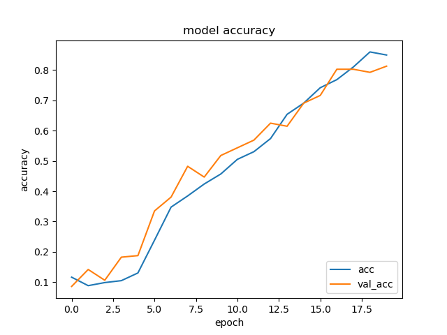
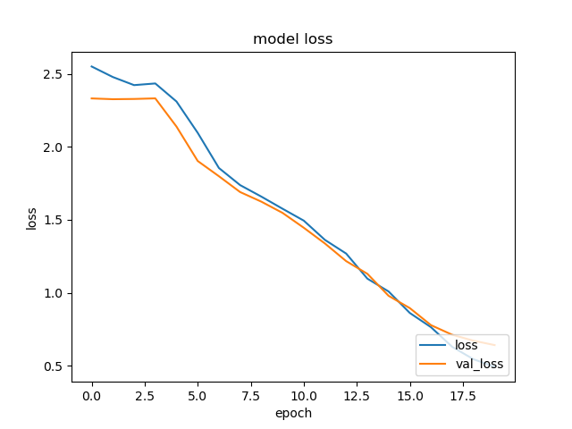
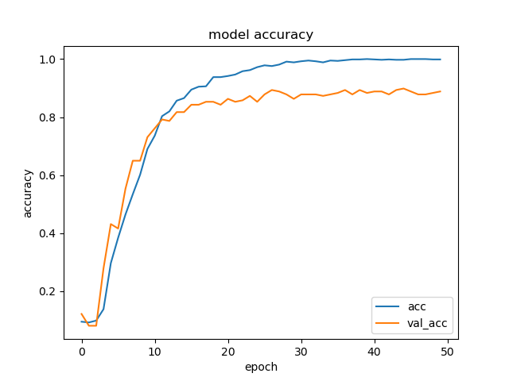
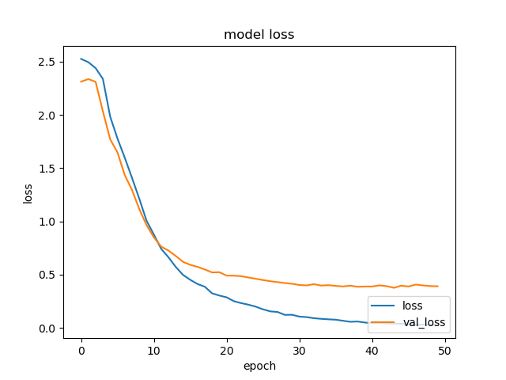
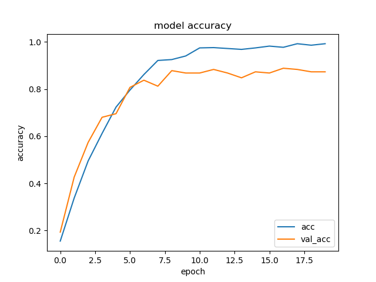
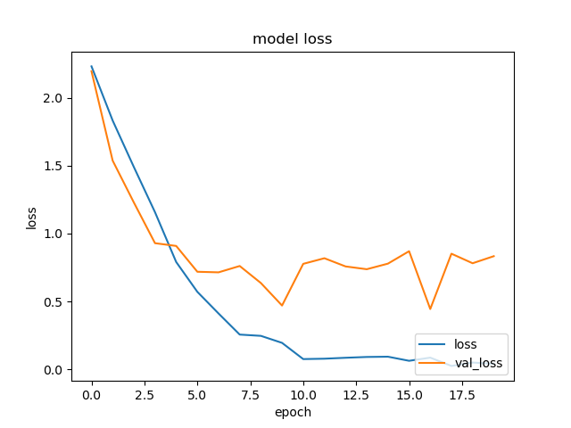
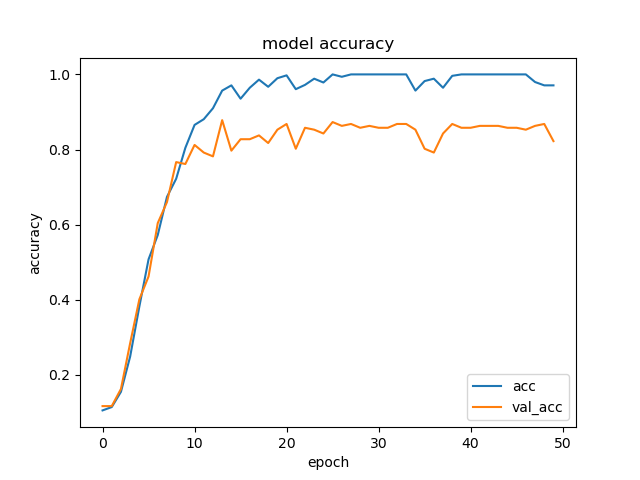
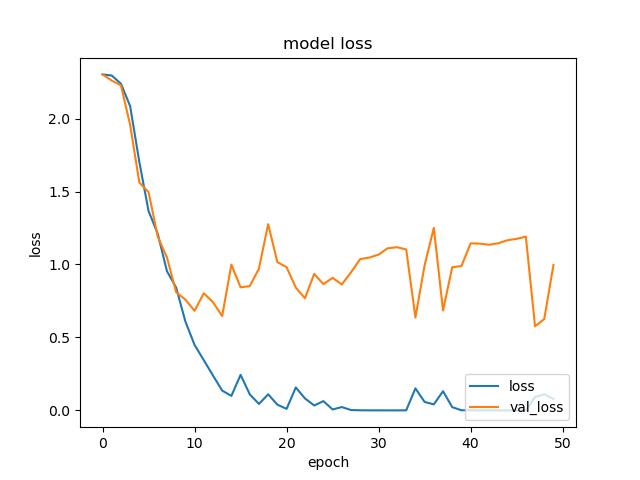

# Video Classificaiton

## Overview

- Video classification was performed for 10 classes from UCF-101.
- Keras is used for implementation and Tensorflow is used for the backend.
- The following models are implemented.
  - 3DCNN
  - C3D

- Data breakdown
  - Height×Width : 112×112
  - Color: 1channel (=monochrome)
  - Training data: 985(Train on 788, validate on 197)
  - Test data: 389

## Result

### 3DCNN

- 20epoch



```evalute.py
Test loss:  1.15104304780767
Test accuracy:  0.6323907375335693
```

---

- 50epoch



```evalute.py
Test loss:  1.8849351450044944
Test accuracy:  0.4987146556377411
```

---

### C3D

- 20epoch



```evalute.py
Test loss:  4.000657923423845
Test accuracy:  0.596401035785675
```

---

- 50epoch




```evalute.py
Test loss:  3.2583252616241785
Test accuracy:  0.5604113340377808
```

## Require

### Enviroments

- Windows10
- Python 3.7.3

### Libraly

- Keras==2.3.1
- matplotlib==3.1.3
- opencv-python==4.2.0.32
- Pillow==7.0.0
- scikit-learn==0.22.2
- Tensorflow-gpu==2.0.0
- tqdm==4.43.0
