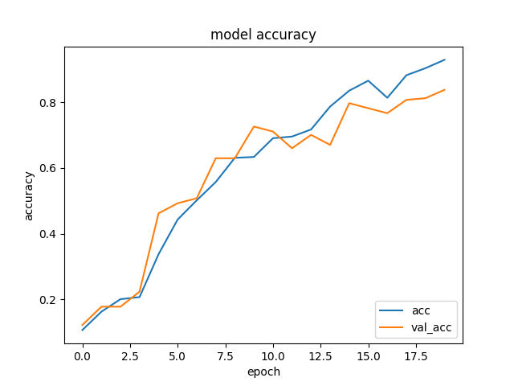
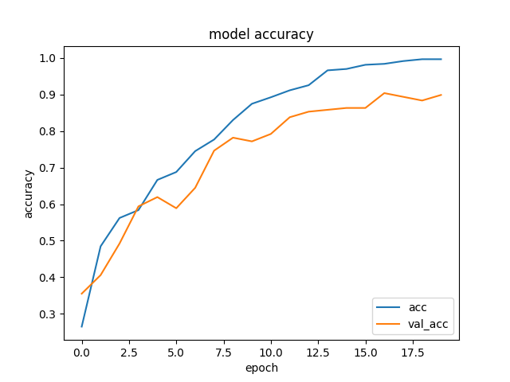
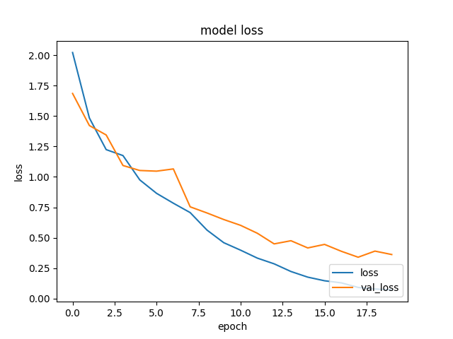

# Video Classificaiton

## Overview

- Video classification was performed for 10 classes from UCF-101.
- Keras is used for implementation and Tensorflow is used for the backend.
- The following models are implemented.
  - 3DCNN
  - C3D
  - LSTM

- Data breakdown
  - Height×Width : 112×112
  - Color: 1channel (=monochrome)
  - Training data: 985(Train on 788, validate on 197)
  - Test data: 389

## Result

### 3DCNN


```evalute.py
Test loss:  1.8186967372894287
Test accuracy:  0.305912584066391
```

---

### C3D



```evalute.py
Test loss:  2.2490131855010986
Test accuracy:  0.5089974403381348
```

---

### LSTM



```evalute.py
Test loss:  1.3995455503463745
Test accuracy:  0.5295630097389221
```

## Require

### Enviroments

- Windows10
- Python 3.7.3

### Libraly

See "requirements.txt".
